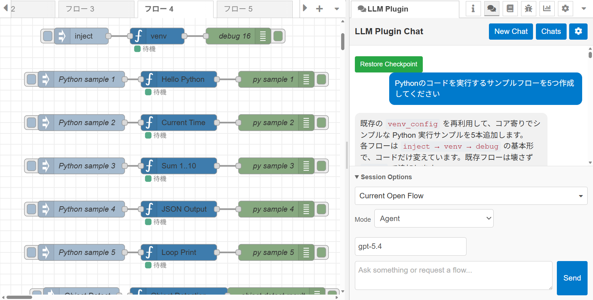
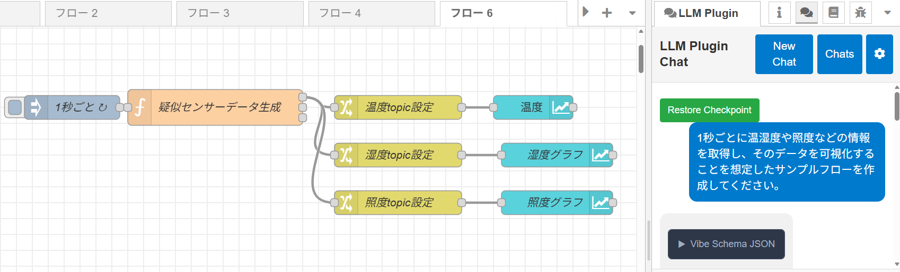

# LLM Plugin for Node-RED

[](https://github.com/sponsors/404background)
[](https://www.npmjs.com/package/@background404/node-red-contrib-llm-plugin)
[](https://www.npmjs.com/package/@background404/node-red-contrib-llm-plugin)

LLM Plugin is a Node-RED sidebar extension for chatting with LLMs, generating/modifying flows, and importing results into the active tab.

Click the image below to watch the video:
[](https://youtu.be/Z8nCtEs4Ows)

Nodes that are not core nodes are intended to be added to the flow before being passed to the LLM. This is because it is unclear how to specify the information required by the nodes.

With [python-venv node](https://qiita.com/background/items/3244fc1b70cc454befef):
[](https://youtu.be/WAAmw7IXev0)

With Dashboard 2.0:
[](https://youtu.be/HPYuoEL6y_o)

## Install

Add from "Manage palette" or

```bash
npm install @background404/node-red-contrib-llm-plugin
```

Restart Node-RED after install.

## Quick Start

1. Open the LLM Plugin sidebar.
2. Configure provider in Settings:
- Ollama: set URL (default `http://localhost:11434`)
- OpenAI: set API key
3. Pick which flow tabs to include via the **flow selector** (defaults to *Current Open Flow*; check additional tabs in the dropdown to send them too).
4. Select **Agent** mode for auto-apply, or **Ask** mode for manual import.
5. Enter model and prompt.
6. Click **Send** to generate and/or apply the flow.

## Recommended Usage

For custom/community nodes, keep a small sample flow in the active tab so it is sent as *Current Open Flow*.
The model then follows real node/property patterns from that sample instead of relying on fixed per-node prompt rules.

## Features

- **Chat history**: conversations are persisted on the server and can be loaded, deleted, or continued across sessions.
- **Checkpoint / Restore**: flow snapshots are saved before and after each import, allowing rollback to any previous state.
- **Custom system prompt**: add persistent instructions (preferred node types, coding style, language) via Settings.

## Flow Import

- Supports Vibe Schema and raw Node-RED JSON.
- Accepts mixed response text + JSON (with or without code fences).
- Preserves robust parsing when function code contains comment tokens in JSON strings.
- Agent mode supports connection updates, LLM-driven deletions, and checkpoint-based restore.
- Apply mode is model-driven via top-level `applyMode` (`edit-only`, `merge`, `overwrite`, `delete-only`).

## More Docs

- Implementation guide: [src/README.md](src/README.md)
- Prompt template: [src/prompt_system.txt](src/prompt_system.txt)

## Security Notice

When sharing your Node-RED project (e.g., via Git, exporting the user directory, or sharing the environment), please be aware that this plugin saves your API keys (like OpenAI) using the standard Node-RED settings API (`RED.settings`). 
Depending on your Node-RED configuration, these settings may be stored in files such as `flows_cred.json` or `.config.json` within your Node-RED user directory. 
**This is not unique to this plugin; any Node-RED node or plugin storing credentials works similarly.**
Always ensure you ignore these credential files in your `.gitignore` and do not share them publicly to prevent accidental leakage of your private API keys. The plugin itself masks keys in the UI and redacts them from logs, but the underlying storage file on your disk remains sensitive.

## Notes

- This plugin is under active development.
- Model output quality varies by model and prompt.

## Feedback

Please report issues at:
https://github.com/404background/node-red-contrib-llm-plugin/issues
