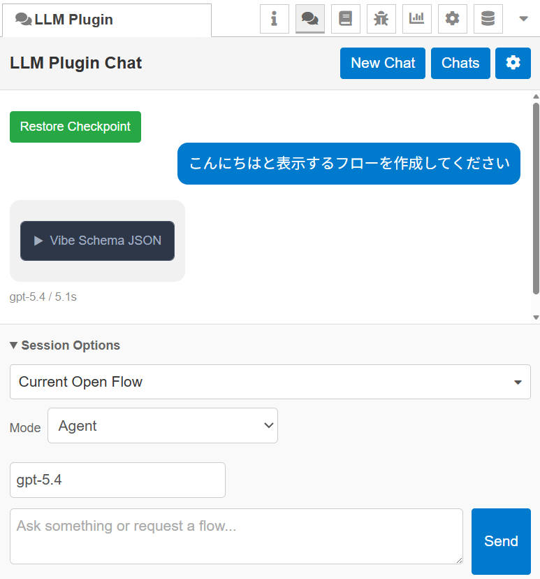

# LLM Plugin for Node-RED

LLM Plugin is a Node-RED sidebar extension that lets you interact with large language models (LLMs) directly from the Node-RED editor. You can chat with an LLM, send existing flows to the LLM for modification or explanation, and import flows the LLM suggests.

Click the image below to play the demo video on YouTube.
[](https://youtu.be/DSk61QEyg0w)

## Key Capabilities

- **AI-Powered Chat**: Chat with an LLM directly in the sidebar to get help with Node-RED concepts or JavaScript code.
- **Flow Generation & Modification**: Describe what you want, and the LLM will generate the flow JSON. You can also send your current flow selection to request edits or optimizations.
- **Smart Flow Analysis**: The plugin analyzes your flows and provides logical explanations of data flow and behavior, avoiding technical jargon like IDs or coordinates.
- **One-Click Import**: Easily import LLM-generated flows. The importer automatically handles ID remapping, sanitizes nodes, and prevents the creation of unwanted flow tabs.
- **Multi-Provider Support**:
  - **Ollama**: Run local models (like Llama 3, Mistral) for privacy and offline capability.
  - **OpenAI**: Use GPT-4 or other OpenAI models for high-performance reasoning.
- **History Management**: Chat sessions are saved locally, allowing you to review past conversations.

## Installation

You can install the plugin via the Node-RED Palette Manager or by running the following command in your Node-RED user directory (typically `~/.node-red`):

```bash
npm install @background404/node-red-contrib-llm-plugin
```

Restart Node-RED to load the plugin.

## Configuration

Open the LLM Plugin sidebar tab and click the **Settings (gear icon)**.

### Ollama (Local)
1. Ensure [Ollama](https://ollama.com/) is installed and running (`ollama serve`).
   - To allow access from other devices, set `OLLAMA_HOST=0.0.0.0` before starting Ollama.
2. Select **Ollama** as the provider.
3. Enter the **Ollama URL** (default: `http://localhost:11434`). Both `http://` and `https://` URLs are supported.
4. Set the model name directly in the chat interface (e.g., `llama3`, `mistral`).

### OpenAI
1. Select **OpenAI** as the provider.
2. Enter your **API Key**.
3. Set the model name directly in the chat interface (e.g., `gpt-4o`, `gpt-4-turbo`).

> **Warning**: OpenAI API usage incurs costs. Sending large flows as context can consume significant tokens.

## Usage

1. **Open the Sidebar**: Select "LLM Plugin" from the sidebar dropdown.
2. **Chat**: Type your question or request.
3. **Context Awareness**: Check "Send current flow" to include the complete flow of your active tab, helping the LLM understand your context. All nodes on the tab are sent without truncation.
4. **Importing**: If the LLM generates a flow (in a JSON code block), an "Import Flow" button will appear. Click it to add the nodes to your current workspace.
5. **Retry**: Click the retry button on any assistant message to regenerate the response.

## Security

### API Key Management

The plugin takes several measures to protect your OpenAI API key:

- **Server-side only**: The API key is stored in Node-RED's internal configuration (typically `~/.node-red/.config.runtime.json`) via `RED.settings`, and is **never** included in flow exports.
- **Masked in transit**: The `GET /llm-plugin/settings` endpoint returns only a masked version of the key (e.g., `sk-ab...WXYZ`). The full key is **never sent to the browser**.
- **Preserve on save**: When saving settings without entering a new key, the existing key is preserved server-side.
- **Password input**: The API key field uses `type="password"` with `autocomplete="off"` to prevent browser auto-fill and shoulder surfing.

### Other Security Measures

- **Ollama URL protection**: The Ollama URL is only used for server-side API calls and settings form display. It is **never** included in LLM prompts, chat history, or flow exports. Error messages containing the URL are shown temporarily in the UI but are **not** persisted.
- **Settings whitelist**: The `POST /llm-plugin/settings` endpoint only accepts known fields (`provider`, `ollamaUrl`, `openaiApiKey`), preventing injection of arbitrary data.
- **Credential stripping**: When sending flow context to the LLM, the `credentials` property is defensively stripped from all nodes at both the client and server level.
- **Error sanitization**: OpenAI SDK errors are wrapped in clean `Error` objects before being logged or returned, preventing leakage of internal headers or tokens.
- **Path traversal protection**: All file-serving endpoints use `path.basename()` and reject `..` sequences.
- **XSS protection**: Chat messages are rendered with the `marked` library (with HTML escaping) when available. The fallback formatter also escapes HTML entities before applying Markdown-like formatting.
- **Chat file sanitization**: Chat history filenames are sanitized to contain only alphanumeric characters, hyphens, and underscores.

## Flow Import

The importer is designed to robustly extract Node-RED flow JSON from LLM responses:

- **Flexible parsing**: Supports `` ```json ``, `` ```JSON ``, `` ``` `` (no language tag), and `` ```javascript `` code fences. Also detects raw JSON arrays outside code fences as a fallback.
- **Multi-block handling**: When the LLM outputs multiple JSON code blocks, the importer picks the **last valid** one (LLMs typically produce the final answer last).
- **ID conflict resolution**: If imported node IDs conflict with existing nodes, new IDs are automatically generated.
- **Tab node filtering**: `tab` nodes are automatically stripped to prevent creating unwanted flow tabs.
- **Workspace assignment**: All imported nodes are assigned to the currently active workspace.
- **Validation warnings**: The importer warns about empty function nodes and missing output connections.

## Architecture

| Layer | File | Role |
|---|---|---|
| Entry | `llm_plugin.js` / `llm_plugin.html` | Server initialization & client script loader |
| Server | `src/server.js` | HTTP API routes, Ollama/OpenAI calls, chat persistence |
| Client loader | `src/client.js` | Dynamically loads all client modules in order |
| Settings | `src/settings.js` | Settings UI manager (provider, URL, API key) |
| Chat Manager | `src/chat_manager.js` | Chat session CRUD, server persistence |
| Importer | `src/importer.js` | JSON extraction from LLM output, flow import |
| UI Core | `src/ui_core.js` | Message rendering, Markdown formatting, flow context |
| Vibe UI | `src/vibe_ui.js` | Sidebar tab UI, settings dialog, generation handler |

## Notes & Limitations

- **Development Status**: This plugin is currently in development.
- **Model Behavior**: Responses may vary depending on the LLM model used. Occasionally, the generated flow might be incomplete or incorrect.
- **Import Safety**: The importer automatically strips out `tab` nodes to prevent creating unnamed tabs. If an import fails, try asking the LLM to regenerate the JSON.

## Feedback

If you encounter any bugs or have feature requests, please report them on [GitHub Issues](https://github.com/404background/node-red-contrib-llm-plugin/issues). Your feedback is highly appreciated as we continue to improve the plugin.
