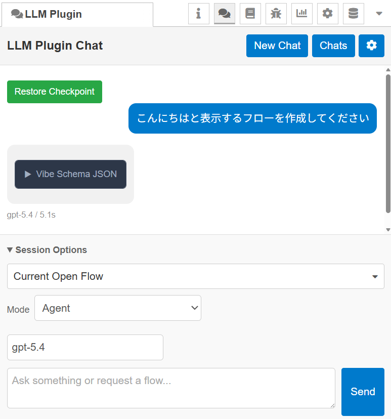
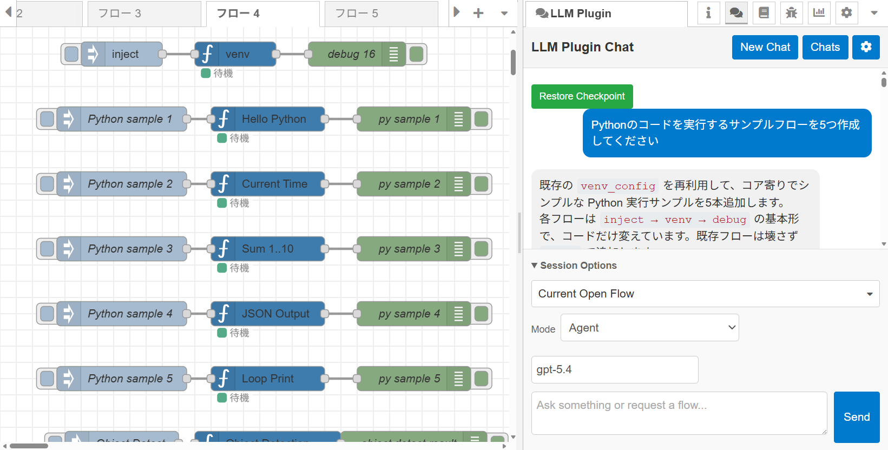
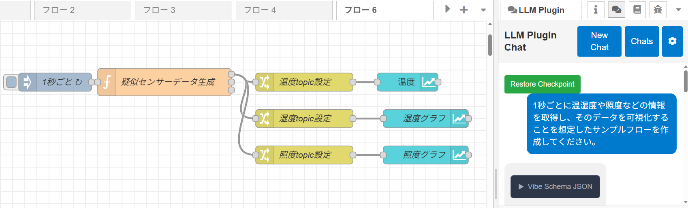
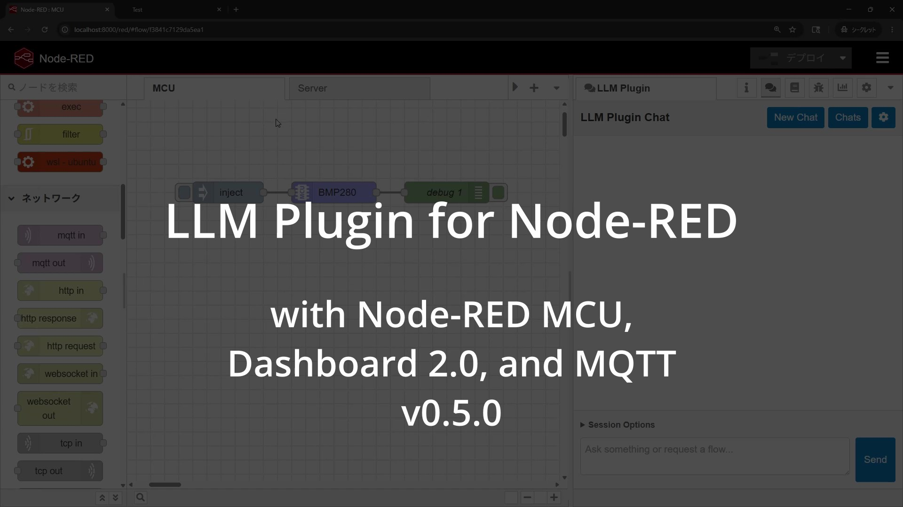

# LLM Plugin for Node-RED

[](https://github.com/sponsors/404background)
[](https://www.npmjs.com/package/@background404/node-red-contrib-llm-plugin)
[](https://www.npmjs.com/package/@background404/node-red-contrib-llm-plugin)

LLM Plugin is a Node-RED sidebar extension for chatting with LLMs, generating/modifying flows, and importing results into the active tab. It also ships an **LLM workflow node** so flows can call an LLM (and, in Agent mode, add nodes to a flow) without the sidebar — see [Workflow Node](#workflow-node).

## Demos

Click the image below to watch the video:
[](https://youtu.be/Z8nCtEs4Ows)

With python-venv node:
[](https://youtu.be/WAAmw7IXev0)

With Dashboard 2.0:
[](https://youtu.be/HPYuoEL6y_o)

With Node-RED MCU (v0.5):
[](https://youtu.be/bnRr9mLuTVQ)

## Install

Add from "Manage palette" or

```bash
npm install @background404/node-red-contrib-llm-plugin
```

Restart Node-RED after install.

## Quick Start

1. Open the LLM Plugin sidebar.
2. Configure provider in Settings:
- Ollama: set URL (default `http://localhost:11434`)
- OpenAI: set API key
- Custom (OpenAI-compatible): set Base URL (e.g. `http://localhost:8080/v1`) and, if required, an API key. Use for llama.cpp, LM Studio, vLLM, LocalAI, or any other server speaking the OpenAI chat-completions API.
3. Pick which flow tabs to include via the **flow selector** (defaults to *Current Open Flow*; check additional tabs in the dropdown to send them too).
4. Select **Agent** mode for auto-apply, or **Ask** mode for manual import.
5. Enter model and prompt.
6. Click **Send** to generate and/or apply the flow.

## Recommended Usage

It is highly recommended to add custom or non-core nodes to your flow before passing them to the LLM. Since the LLM does not inherently know the required properties of custom nodes, keeping a small sample flow in the active tab ensures it is sent as the *Current Open Flow*.
The model will then follow real node/property patterns from that sample instead of relying on fixed per-node prompt rules.

The demo video above shows this pattern with the
[python-venv](https://flows.nodered.org/node/@background404/node-red-contrib-python-venv)
node: a minimal inject → venv → debug flow kept in the active tab.

## Features

- **Chat history**: conversations are persisted on the server and can be loaded, deleted, or continued across sessions.
- **Checkpoint / Restore**: a snapshot of the flow is taken immediately before each import, and a per-message Restore button rewinds the workspace to that pre-edit state.
- **Custom system prompt**: add persistent instructions (preferred node types, coding style, language) via Settings.

## Flow Import

- Supports Vibe Schema and raw Node-RED JSON.
- Accepts mixed response text + JSON (with or without code fences).
- Preserves robust parsing when function code contains comment tokens in JSON strings.
- Agent mode seamlessly handles connection updates and LLM-driven deletions.
- All schema applies use merge semantics: listed nodes are added or updated, aliases mapped to `null` are deleted, anything not mentioned is left alone.

## Workflow Node

The package also registers an `LLM` runtime node (palette category
**llm-plugin**) so a flow can call an LLM. Provider, model and target flows are
set on the node; API keys and URLs come from the sidebar Settings.

- **Ask** — returns the model's reply on `msg.payload`. Selected flows are sent as context.
- **Agent** — same, then applies the changes **live in the open editor**, like the sidebar; review and Deploy.

Flows are a multi-select (none / one / many) and apply in both modes. Agent mode
needs an open editor; node interactions are not saved to chat history and have no
Restore Checkpoint. The node shows its progress as a status (elapsed time while
waiting) and has a configurable timeout (default 3600 s — local LLMs can be slow;
0 = no limit, `msg.timeout` overrides).

Agent mode can optionally **Auto deploy** right after applying (a developer
feature — no review step; intended for automated dev loops, not production).

To try it, import an example via **Menu → Import → Examples**:
`llm-nodes` (Ask + Agent demo — Agent edits appear live in the editor and you
review and Deploy manually) or `llm-self-feedback` (a self-improvement loop:
Agent + Auto deploy, hard-capped at 5 iterations).

See **[docs/en/runtime-node.md](docs/en/runtime-node.md)** ([日本語](docs/jp/runtime-node.md)) for full details.

## Tests

```bash
npm test          # offline regression suite (converter, layout, importer scoping)
npm run test:llm  # live round-trip against a real LLM endpoint
```

`npm test` needs nothing but Node and always runs offline.

`npm run test:llm` drives the same engine the sidebar and the LLM node use —
prompt construction, a real HTTP call to the provider, Vibe Schema extraction
from the reply, and conversion into an importable flow — so it catches
breakage that only shows up against an actual model. Endpoint and model come
from `llm-test-config.json` in the repo root; it is git-ignored, so copy the
template to create it:

```bash
cp llm-test-config.example.json llm-test-config.json
```

| Field | Meaning |
|-------|---------|
| `ollamaUrl` | Endpoint to test against (default `http://localhost:11434`) |
| `model` | Model name (default `gemma3:4b`) |
| `timeoutMs` | Per-request timeout |
| `attempts` | Retries allowed for a reply to contain a parseable schema — small models sometimes answer in prose first |
| `showReplies` | Print the model's raw replies so you can see what it actually said |

`LLM_TEST_URL` / `LLM_TEST_MODEL` override the file for a single run:

```bash
LLM_TEST_MODEL=llama3.2 npm run test:llm
```

Model output is not deterministic, so the flow assertions are structural (a
schema must be extractable; the flow it yields must be one `RED.nodes.import`
would accept). Exit codes: `0` passed, `1` failed, `2` skipped — the endpoint
was unreachable, the model was not installed, or the endpoint failed to serve
the request.

## Documentation

All developer documentation lives in **[`docs/`](docs/)**, with English (`docs/en/`)
and Japanese (`docs/jp/`) versions of every page. Start from the
[documentation hub](docs/README.md).

> **AI agents / contributors:** when developing on this repository, read the
> `docs/` folder first — especially [`design`](docs/en/design.md) (why the
> processing flow, rules, and priorities are the way they are) and
> [`architecture`](docs/en/architecture.md) (what each module does). Docs are
> consolidated here rather than scattered across `src/`, `src/core/`, and `node/`.
> Keep the `en/` and `jp/` versions in sync when you change either.

- Documentation hub: [docs/README.md](docs/README.md)
- Design notes (flow / rules / priorities & rationale): [en](docs/en/design.md) · [jp](docs/jp/design.md)
- Architecture (implementation guide): [en](docs/en/architecture.md) · [jp](docs/jp/architecture.md)
- Vibe Schema: [en](docs/en/vibe-schema.md) · [jp](docs/jp/vibe-schema.md)
- Layout engine: [en](docs/en/layout.md) · [jp](docs/jp/layout.md)
- Workflow node: [en](docs/en/runtime-node.md) · [jp](docs/jp/runtime-node.md)
- Prompt template: [src/prompt_system.txt](src/prompt_system.txt)

## Security Notice

### Agent mode executes what the model writes

Agent mode applies the model's reply to your canvas **without a confirmation step**, and **Auto deploy** deploys it immediately. Generated flows can contain `function` nodes (arbitrary JavaScript in the Node-RED process) and `exec` nodes (arbitrary shell commands), and there is deliberately no node-type restriction — limiting what the model may build would defeat the feature.

So whoever controls the model's output controls the Node-RED host. Point Agent mode only at an LLM endpoint you trust, and **do not feed untrusted text into an Agent node** (an `http in` payload, an inbound MQTT message, scraped page content). With Auto deploy enabled that is a direct path from a remote string to code execution on your machine. Ask mode has no such property — it only returns text.

### Credentials and endpoints

API keys (OpenAI and Custom-endpoint) are stored encrypted in `<userDir>/llm-plugin/credentials.json` (AES-256-GCM, file mode `0600`), under a key the plugin generates for itself and keeps in `RED.settings` as `llmPluginCredentialSecret`. Non-secret settings stay in `RED.settings` too. Keys are masked in the UI and redacted from logs — by exact value, so a key of any shape is covered. Keys saved by earlier versions are still read and re-encrypted on the next save.

A stored key is never carried over to a new endpoint behind your back: change the Custom endpoint Base URL and the plugin requires you to re-enter its API key.

### Multi-user installs

If you enable `adminAuth`, the plugin's endpoints require an authenticated editor session (`llm-plugin.read` / `llm-plugin.write` permissions). Note that Agent-mode results are broadcast to **every** open editor session, so in a shared instance one user's Agent node edits everyone's canvas.

The encrypted file is only as safe as the key that opens it, and that key lives in `.config.runtime.json`. When sharing your Node-RED user directory (Git, backups, environment exports), keep `credentials.json`, `flows_cred.json`, `.config.*.json` and `settings.js` out of the share. Older installs that stored the API key in plaintext are migrated to the encrypted file automatically on first boot.

## Notes

- This plugin is under active development.
- Model output quality varies by model and prompt.
- **Cloud / sandboxed Node-RED hosts** (e.g. enebular): chat history
  and flow checkpoints are persisted to `<userDir>/llm-plugin/` when
  that location is writable, else to the OS temp directory, else
  in-memory only. The plugin never writes to its own install dir, so
  it loads cleanly on read-only plugin filesystems.

## Links

Please report issues at: [GitHub Issues](https://github.com/404background/node-red-contrib-llm-plugin/issues)

Node-RED [API Reference](https://nodered.org/docs/api/)

My article: [『Node-REDのプラグインを開発してみる　その2（LLM Plugin v0.4.0）』](https://404background.com/program/node-red-plugin-2/)

