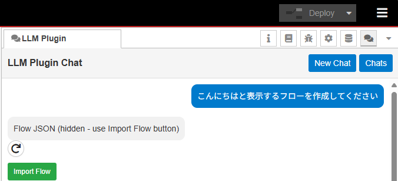

# LLM Plugin for Node-RED

LLM Plugin is a Node-RED sidebar extension that lets you interact with large language models (LLMs) directly from the Node-RED editor. You can chat with an LLM, send existing flows to the LLM for modification or explanation, and import flows the LLM suggests.

Click the image below to play the demo video on YouTube. 
[](https://youtu.be/DSk61QEyg0w)

## Key Capabilities

- **AI-Powered Chat**: Chat with an LLM directly in the sidebar to get help with Node-RED concepts or JavaScript code.
- **Flow Generation & Modification**: Describe what you want, and the LLM will generate the flow JSON. You can also send your current flow selection to request edits or optimizations.
- **Smart Flow Analysis**: The plugin analyzes your flows and provides logical explanations of data flow and behavior, avoiding technical jargon like IDs or coordinates.
- **One-Click Import**: Easily import LLM-generated flows. The importer automatically handles ID remapping, sanitizes nodes, and prevents the creation of unwanted flow tabs.
- **Multi-Provider Support**:
  - **Ollama**: Run local models (like Llama 3, Mistral) for privacy and offline capability.
  - **OpenAI**: Use GPT-4 or other OpenAI models for high-performance reasoning.
- **History Management**: Chat sessions are saved locally, allowing you to review past conversations.

## Installation

You can install the plugin via the Node-RED Palette Manager or by running the following command in your Node-RED user directory (typically `~/.node-red`):

```bash
npm install @background404/node-red-contrib-llm-plugin
```

Restart Node-RED to load the plugin.

## Configuration

Open the LLM Plugin sidebar tab and click the **Settings (gear icon)**.

### Ollama (Local)
1. Ensure [Ollama](https://ollama.com/) is installed and running (`ollama serve`).
   - To allow access from other devices, set `OLLAMA_HOST=0.0.0.0` before starting Ollama.
2. Select **Ollama** as the provider.
3. Enter the **Ollama URL** (default: `http://localhost:11434`).
4. Set the model name directly in the chat interface (e.g., `llama3`, `mistral`).

### OpenAI
1. Select **OpenAI** as the provider.
2. Enter your **API Key**.
   - *Note: Your API key is stored in Node-RED's internal configuration (typically `~/.node-red/.config.runtime.json`) and is NOT included when exporting flows.*
3. Set the model name directly in the chat interface (e.g., `gpt-4o`, `gpt-4-turbo`).
   - *Warning: OpenAI API usage incurs costs. Sending large flows as context can consume significant tokens.*

## Usage

1. **Open the Sidebar**: Select "LLM Plugin" from the sidebar dropdown.
2. **Chat**: Type your question or request.
3. **Context Awareness**: The plugin automatically includes a summary of your currently active flow to help the LLM understand your context.
4. **Importing**: If the LLM generates a flow (in a JSON code block), an "Import Flow" button will appear. Click it to add the nodes to your current workspace.

## Notes & Limitations

- **Development Status**: This plugin is currently in development.
- **Model Behavior**: Responses may vary depending on the LLM model used. Occasionally, the generated flow might be incomplete or incorrect.
- **Import Safety**: The importer automatically strips out `tab` nodes to prevent creating unnamed tabs. If an import fails, try asking the LLM to regenerate the JSON.

## Feedback

If you encounter any bugs or have feature requests, please report them on [GitHub Issues](https://github.com/404background/node-red-contrib-llm-plugin/issues). Your feedback is highly appreciated as we continue to improve the plugin.
